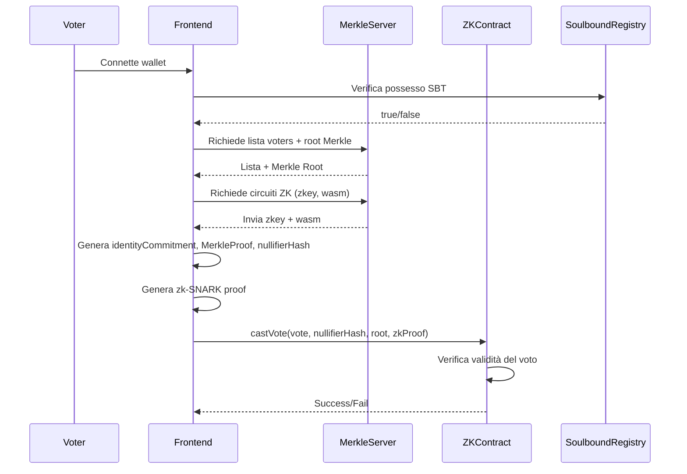
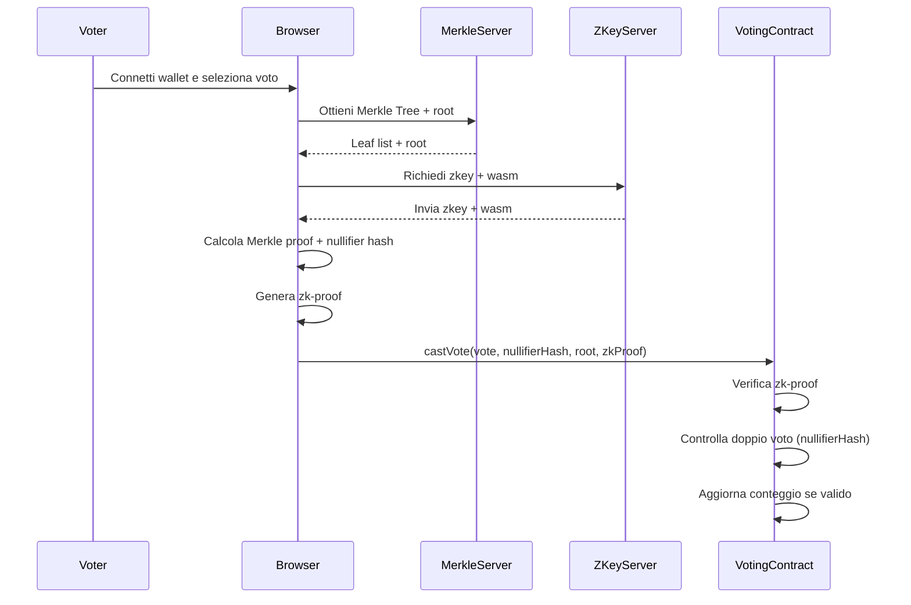
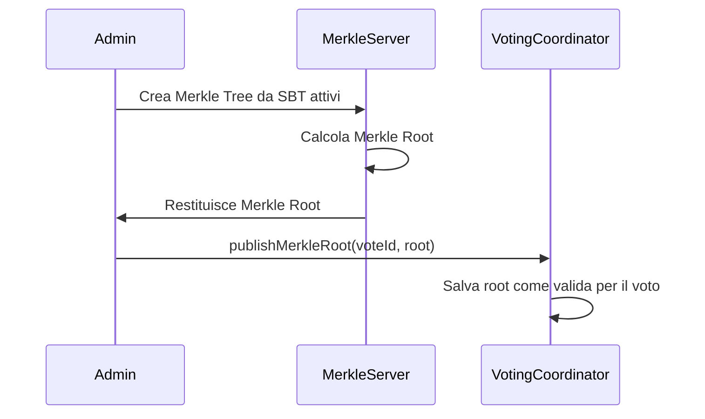
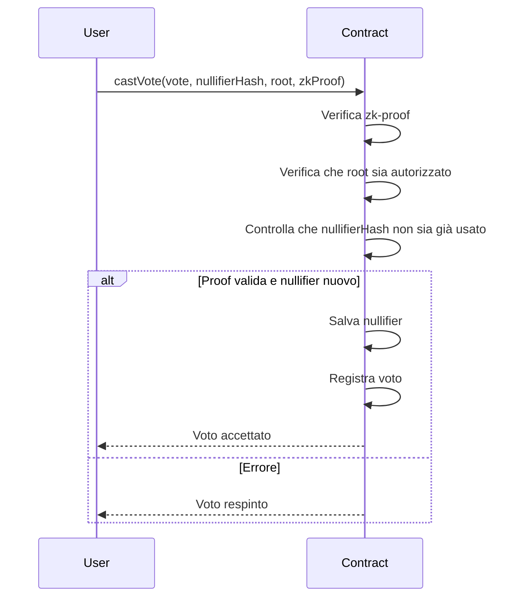
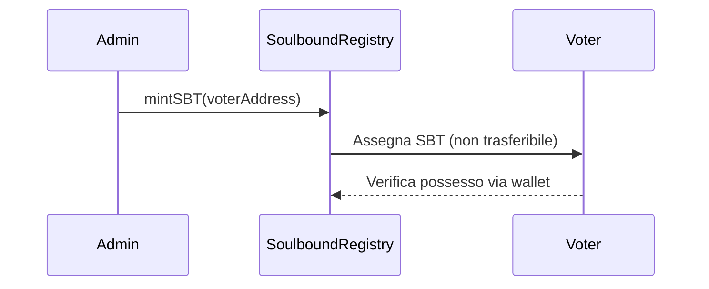
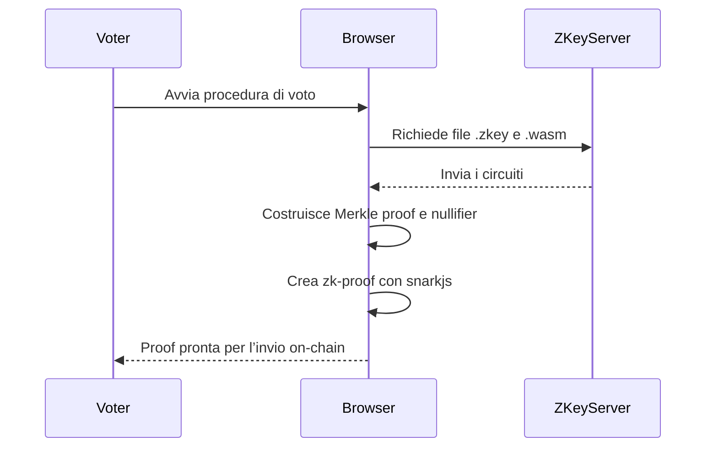

# 3-Voting, NapulETH Hackathon 2025

# Diagrammi di sequenza iniziali

### Flusso del voto

### Creazione voto e pubblicazione root

### Verifica on-chain del voto

### Mint del SBT

### Generazione ed invio della zkp

